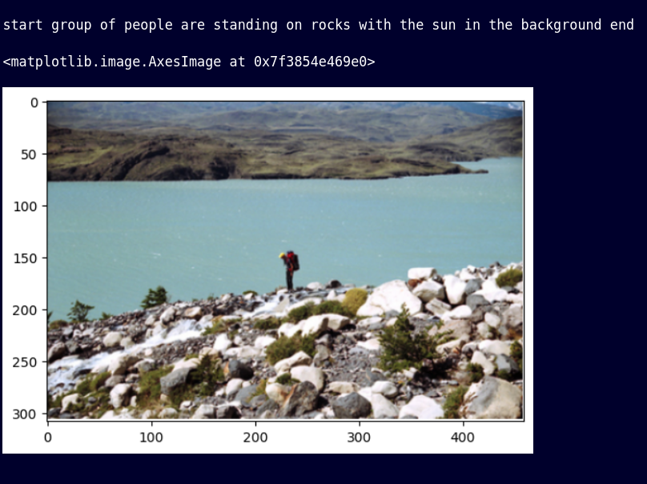

# Image Caption Generator

## Overview

This repository contains code for an image caption generator using deep learning models based on LSTM and CNN architectures. The model is trained on Flickr8k dataset, which can be accessed [here](https://github.com/jbrownlee/Datasets/releases/download/Flickr8k/Flickr8k_Dataset.zip).

## Model Summary

### How the prediction model works 

#### The image caption generator model integrates Convolutional Neural Networks (CNNs) and Long Short-Term Memory (LSTM) networks to produce descriptive captions for images. Here's a detailed breakdown of the process:

#### Model Architecture:

##### The model consists of two primary components:
- CNN (Convolutional Neural Network): This component extracts features from the input image.
- LSTM (Long Short-Term Memory): This component generates the caption based on the extracted image features and the previously generated words.
#### Image Feature Extraction:
- The CNN part uses a pretrained Xception model to extract a 2048-dimensional feature vector from the input image.
- The image is resized to 299x299 pixels, converted to a numpy array, normalized, and passed through the Xception model.
#### Caption Generation:
- The LSTM part takes the extracted features and a sequence of words as input.
- An embedding layer converts the sequence of words into dense vectors.
- A dropout layer helps prevent overfitting.
- The LSTM layer processes the sequence and generates the next word.
- A dense layer with softmax activation outputs a probability distribution over the vocabulary, indicating the most likely next word.
#### Sequence Generation:

- The initial input sequence starts with the token 'start'.
- The tokenizer converts the input sequence into a sequence of integers and pads it to the maximum length.
- The model predicts the next word in the sequence, and this word is appended to the input sequence.
- This process is repeated iteratively until the model predicts the end-of-sequence token 'end' or reaches the maximum sequence length.
#### Training the Model:

- The model is trained on a dataset of images and their corresponding captions.
- The training data is prepared by generating input-output pairs, where the input consists of the image features and a partial caption, and the output is the next word in the caption.
- The model is trained using categorical cross-entropy loss and the Adam optimizer.
#### Generating Captions for New Images:

- Load the pretrained model and tokenizer.
- Extract features from the new image using the Xception model.
- Use the caption generator model to predict the caption by iteratively predicting the next word in the sequence until the caption is complete.

## Files

- `training_caption.ipynb`: IPython Notebook containing the complete code for the image caption generator.

## Workflow

### Running the Notebook

Open `image_caption_generator.ipynb` in Jupyter Notebook and execute each cell to reproduce the entire workflow of the image caption generator.

## Example Images

### Caption Generation

